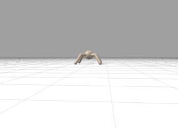
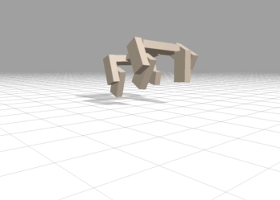
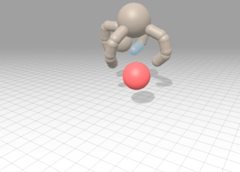
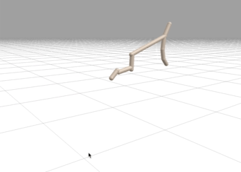
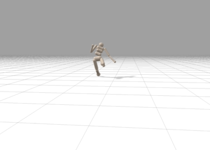

# `BRAX`

Brax is a differentiable physics engine that simulates environments made up
of rigid bodies, joints, and actuators. It's also a suite of learning algorithms
to train agents to operate in these environments (PPO, SAC, evolutionary
strategy, and direct trajectory optimization are implemented).

Brax is written in [JAX](https://github.com/google/jax) and is designed for
use on acceleration hardware. It is both efficient for single-core training, and
scalable to massively parallel simulation, without the need for pesky
datacenters.


*Some policies trained via Brax. Brax simulates environments like this at millions of physics steps per second on a TPU.*

## Colab Notebooks

Explore Brax easily and quickly through a series of colab notebooks:

* [Brax Basics](https://colab.research.google.com/github/google/brax/blob/main/notebooks/basics.ipynb) introduces the Brax API, and demonstrates simulating some basic physics primitives.

## Using Brax locally

To install Brax from source, clone this repo, `cd` to it, and then:

```
python3 -m venv env
source env/bin/activate
pip install --upgrade pip
pip install -e .
```

To train a model:

```
learn
```

Training on NVidia GPU is supported, but you must first install [CUDA, CuDNN,
and JAX with GPU support](https://github.com/google/jax#installation).
