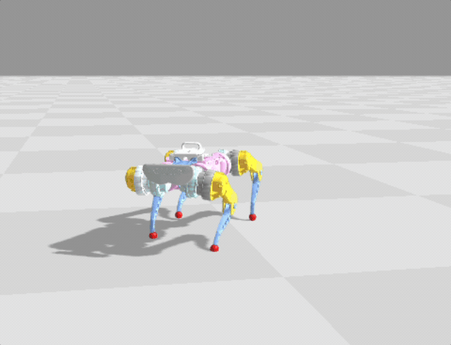
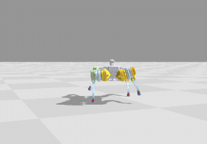

# Google Barkour

## Overview

This repository contains a script to evaluate policies on the [Barkour](https://github.com/google-deepmind/mujoco_menagerie/tree/main/google_barkour_v0#google-barkour-v0-description-mjcf) environment benchmark. See `score_barkour.py` for additional details on how policies get evaluated, or see the publication on [arxiv](https://arxiv.org/abs/2305.14654).

## Training Joystick Policies

For instructions on how to train a joystick policy on the [Barkour v0](https://github.com/google-deepmind/mujoco_menagerie/tree/main/google_barkour_v0) quadruped on GPU/TPU with Brax, see the [tutorial notebook](https://colab.research.google.com/github/google/brax/blob/main/brax/experimental/barkour/tutorial.ipynb). The environment is defined in `BarkourEnv`, and joystick policies train in 6 minutes on an A100 GPU.

  

For [Barkour vB](https://github.com/google-deepmind/mujoco_menagerie/tree/main/google_barkour_vb) quadruped, see the [MJX tutorial notebook](https://colab.research.google.com/github/google-deepmind/mujoco/blob/main/mjx/tutorial.ipynb). These joystick policies successfully transfer onto the quadruped robot.

  
  

## MJCF Instructions

For robot assets, please see [Barkour vB](https://github.com/google-deepmind/mujoco_menagerie/tree/main/google_barkour_vb) and [Barkour v0](https://github.com/google-deepmind/mujoco_menagerie/tree/main/google_barkour_v0) in the MuJoCo Menagerie repository. The Barkour environment can be found [here](https://github.com/google-deepmind/mujoco_menagerie/blob/main/google_barkour_v0/scene_barkour.xml).

## Publications

If you use this work in an academic context, please cite the following publication:

    @misc{caluwaerts2023barkour,
          title={Barkour: Benchmarking Animal-level Agility with Quadruped Robots},
          author={Ken Caluwaerts and Atil Iscen and J. Chase Kew and Wenhao Yu and Tingnan Zhang and Daniel Freeman and Kuang-Huei Lee and Lisa Lee and Stefano Saliceti and Vincent Zhuang and Nathan Batchelor and Steven Bohez and Federico Casarini and Jose Enrique Chen and Omar Cortes and Erwin Coumans and Adil Dostmohamed and Gabriel Dulac-Arnold and Alejandro Escontrela and Erik Frey and Roland Hafner and Deepali Jain and Bauyrjan Jyenis and Yuheng Kuang and Edward Lee and Linda Luu and Ofir Nachum and Ken Oslund and Jason Powell and Diego Reyes and Francesco Romano and Feresteh Sadeghi and Ron Sloat and Baruch Tabanpour and Daniel Zheng and Michael Neunert and Raia Hadsell and Nicolas Heess and Francesco Nori and Jeff Seto and Carolina Parada and Vikas Sindhwani and Vincent Vanhoucke and Jie Tan},
          year={2023},
          eprint={2305.14654},
          archivePrefix={arXiv},
          primaryClass={cs.RO}
    }